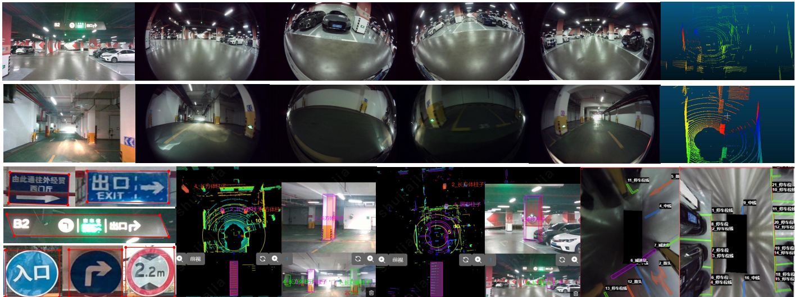
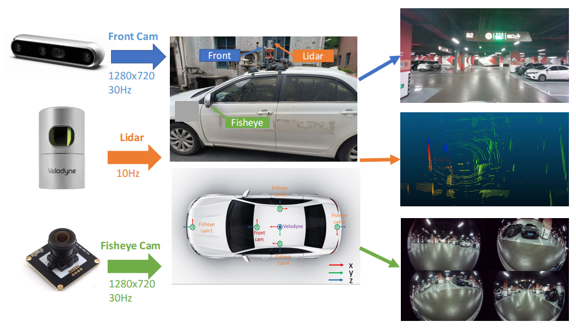
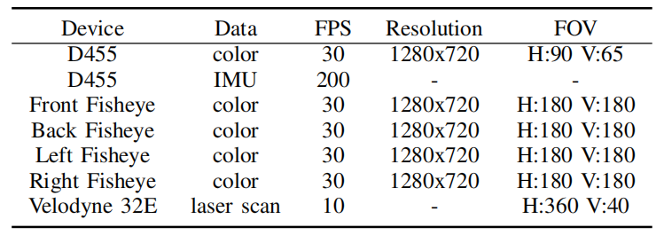

# 3D-SMLoc
A Novel Dataset and Framework for 3D Semantic Mapping and Long-Term Localization in Underground Parking Lots

# 3D-SMLoc Overview
- [Dataset Introduce](#1-dataset-introduce)
- [Sensor specifications](#2-sensor-specifications)
- [Dataset structure](#3-dataset-structure)
- [Download instructions](#4-download-instructions)
- [Prerequisites](#5-prerequisites)
- [Building and examples](6-building-and-examples)
<br>


# 1. Dataset Introduce
<p align="center">
  
</p>
We build the first 3D semantic mapping and long-term localization dataset( 3D-SMLoc) for autonomous driving in 
underground parking lots. Our dataset performs visual front-view, Inertial, surrounding-view and lidar data collection 
over more than one year. The data contains different scenarios of underground parking lots in campus and shopping malls, 
considering different lighting, traffic flow and other conditions. For each frame data, semantic features such as 
contain columns, traffic signs, arrows, parking lines and speed bumps are carefully labeled.

# 2. Sensor specifications
<p align="center">
  
</p>
five camera devices and one lidar device are used for data
collection. A Realsense D455 equipped on the top of the
vehicle provides RGB images and IMU measurements. The
IMU data are hardware synchronized with images from the
Realsense D455. Four fisheye cameras mounted around the
vehicle provide four fisheye images to view the surroundings.The sensors’ specifications are detailed in the table below.
<p align="center">
  
</p>

# 3. Dataset structure
Our dataset contains 11 sequences, the dataset is organized as follows.

```
3D-SMLoc Dataset
    ├── Sequence01
    │   │── back
    │       ├──000000.png
    |       ...
    │   │── front
    │       ├──000000.png
    |       ...
    │   │── left
    │       ├──000000.png
    |       ...    
    │   │── right
    │       ├──000000.png
    |       ...
    │   │── image_color
    │       ├──000000.png
    |       ...
    │   │── velodyne
    │       ├──000000.pcd
    |       ...    
    │   │── imu
    │       ├──imu0.txt
    │   │── timestmp
    │       ├──front.txt
    |       ...    
    │   │── traj
    │       ├──odometry.txt 
    |   ...    

    ├── calib_result
    │   │── color-velodyne
    │   │── D455        
    │   │── fish-color
    │   │── surround

    ├── label_result
    │   │── 3D_columns
    │   │── semantci_label       
    │   │── 2D_box
```

# 4. Download instructions
To download the dataset, please visit the following:
## 4.1 2022-3-12-14-0-31
Some key features are as follows:
  | Date of Collection |Sensors |Download |Features |
  | :---:  |:---:  |:---:  |:---:  |
  | 2022/03/12 |surrounding images, IMU, lidar|(https://web.ugreen.cloud/web/#/share/50d4ef7ff0714b73ab14943eff2d1cd6 提取码：UL5E 百度网盘：https://pan.baidu.com/s/1UgLGEUJdildccbI7dsrbfQ?pwd=vd53 提取码: vd53 )|Poor light,Low dynamic|

## 4.2 2022-3-12-11-46-58
Some key features are as follows:
  | Date of Collection |Sensors |Download |Features |
  | :---:  |:---:  |:---:  |:---:  |
  | 2022/03/12 |surrounding images, IMU, lidar|(https://web.ugreen.cloud/web/#/share/50d4ef7ff0714b73ab14943eff2d1cd6 提取码：UL5E 百度网盘: https://pan.baidu.com/s/1OpgIzeLeWeVScT9t9g_M1w?pwd=44xx 提取码: 44xx )|Medium light,Low dynamic|

## 4.3 2022-3-12-11-18-26
Some key features are as follows:
  | Date of Collection |Sensors |Download |Features |
  | :---:  |:---:  |:---:  |:---:  |
  | 2022/03/12 |surrounding images, IMU, lidar|(https://web.ugreen.cloud/web/#/share/50d4ef7ff0714b73ab14943eff2d1cd6 提取码：UL5E 百度网盘: https://pan.baidu.com/s/1ucAILKTHWbhS80gxXWnWnA?pwd=wv4g 提取码: wv4g )|Good light,Medium dynamic|  

## 4.4 2022-3-24-11-57-11
Some key features are as follows:
  | Date of Collection |Sensors |Download |Features |
  | :---:  |:---:  |:---:  |:---:  |
  | 2022/03/24 |surrounding images, IMU, lidar|[提取码](https://web.ugreen.cloud/web/#/share/EC-uoVv554JJ1225qKj-309B96 百度网盘: https://pan.baidu.com/s/17oquMbyAw55TB0VNVznXcA?pwd=7ja2 提取码: 7ja2 )|Good light,High dynamic|  

## 4.5 2022-10-23-16-5-13
Some key features are as follows:
  | Date of Collection |Sensors |Download |Features |
  | :---:  |:---:  |:---:  |:---:  |
  | 2022/10/23 |surrounding images, IMU, lidar|[提取码](https://web.ugreen.cloud/web/#/share/EC-EWjO554JJ1228tKQ-309B96)|Medium light,Low dynamic|  

## 4.6 2022-10-23-15-21-48
Some key features are as follows:
  | Date of Collection |Sensors |Download |Features |
  | :---:  |:---:  |:---:  |:---:  |
  | 2022/10/23 |surrounding images, IMU, lidar|[提取码](https://web.ugreen.cloud/web/#/share/EC-OUxp554JJ122GANP-309B96)|Good light,Medium dynamic|  

## 4.7 2022-10-23-11-56-54
Some key features are as follows:
  | Date of Collection |Sensors |Download |Features |
  | :---:  |:---:  |:---:  |:---:  |
  | 2022/10/23 |surrounding images, IMU, lidar|[提取码](https://web.ugreen.cloud/web/#/share/EC-wiLn554JJ122My7i-309B96)|Good light,High dynamic|  

## 4.8 2023-2-15-15-29-57
Some key features are as follows:
  | Date of Collection |Sensors |Download |Features |
  | :---:  |:---:  |:---:  |:---:  |
  | 2023/02/15 |surrounding images, IMU, lidar|[提取码](https://web.ugreen.cloud/web/#/share/EC-b03U554JJ122GpjQ-309B96)|Medium light,Low dynamic|  

## 4.9 2023-2-15-14-40-33
Some key features are as follows:
  | Date of Collection |Sensors |Download |Features |
  | :---:  |:---:  |:---:  |:---:  |
  | 2023/02/15 |surrounding images, IMU, lidar|[提取码](https://web.ugreen.cloud/web/#/share/EC-c8uX554JJ122eUdt-309B96)|Good light,High dynamic|  

## 4.10 2023-3-18-12-8-59
Some key features are as follows:
  | Date of Collection |Sensors |Download |Features |
  | :---:  |:---:  |:---:  |:---:  |
  | 2023/03/18 |surrounding images, IMU, lidar|[提取码](https://web.ugreen.cloud/web/#/share/EC-wMv3554JJ122lF3F-309B96)|Medium light,Low dynamic|  

## 4.11 2023-3-18-12-42-5
Some key features are as follows:
  | Date of Collection |Sensors |Download |Features |
  | :---:  |:---:  |:---:  |:---:  |
  | 2023/03/18 |surrounding images, IMU, lidar|[提取码](https://web.ugreen.cloud/web/#/share/EC-otef554JJ1223bpy-309B96)|Good light,High dynamic|  

## 4.12 raw data(rosbag)
All raw data collected by rosbag of above sequences are as follows:
[提取码](https://web.ugreen.cloud/web/#/share/EC-Ypov554JJ122Cgcv-309B96)

## 4.13 label data
All label files are as follows:
链接: https://pan.baidu.com/s/1QmXvAyWVPga0YwV9nfPPvw?pwd=ymbz 提取码: ymbz 


# 5. Prerequisites
We have tested the library in **Ubuntu 16.04**,and **18.04**.

- C++11 or C++0x Compiler
- ROS
- opencv >= 3.4.3
- Eigen 3.3.7
- PCL 1.7
- Ceres 1.14.0
- GTSAM 4.0.3

# 6. Building and examples
- Build
```
mkdir -p ~/semantic_3d_avp_ws/src
cd ~/semantic_3d_avp_ws/src
git clone https://github.com/zhaojinlong-123/3D-SMLoc.git
cd ~/semantic_3d_avp_ws/
catkin_make
```

- Mapping Example
```
cd ~/semantic_3d_avp_ws/
source devel/setup.bash
roslaunch semantic map_avp.launch
```

- Localization Example
```
cd ~/semantic_3d_avp_ws/
source devel/setup.bash
roslaunch semantic localization_avp.launch
```
